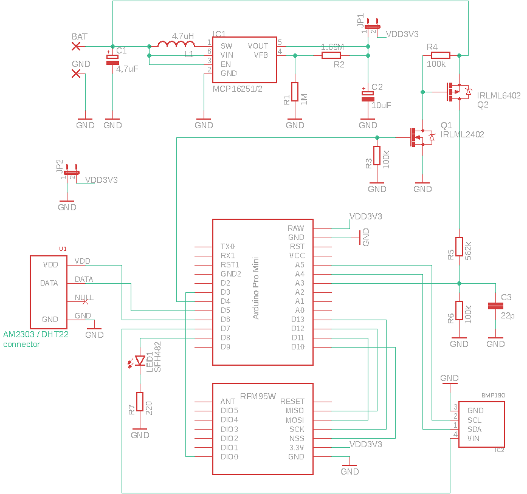

# Environment sensor node

Environment sensor based on Arduino Mini Pro, BMP180, DHT22, HopeRF RFM95W radio (LoRa™️ protocol)

Low power consumption: <10 μA during sleep. Lasts monthes on two AA batteries 

## Schematic 

## Receiver 

Raspberry Pi based receiver https://github.com/denysobukh/RFM95-MQTT-Gateway
