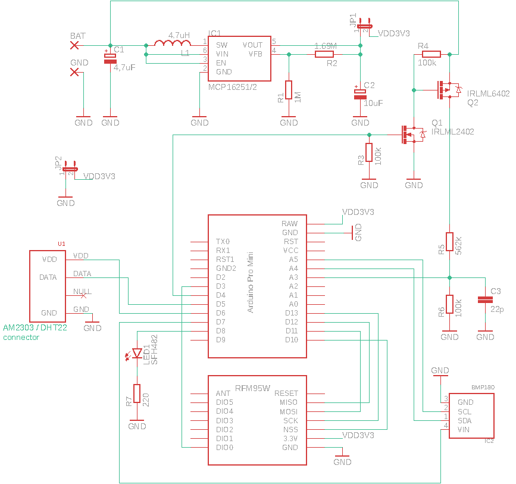

# 🌡️ Environment Sensor Node

> A low-power environmental sensor node built on Arduino Mini Pro that measures ambient conditions and transmits readings over LoRa.

[](https://opensource.org/licenses/MIT)
[-blue)](https://www.arduino.cc/)
[](https://lora-alliance.org/)

## 📋 Table of Contents

- [Overview](#overview)
- [Hardware](#hardware)
- [Pinout](#pinout)
- [LoRa Configuration](#lora-configuration)
- [Message Protocol](#message-protocol)
- [Power Management](#power-management)
- [Building & Flashing](#building--flashing)
- [Debug Mode](#debug-mode)
- [Receiver](#receiver)
- [Schematic](#schematic)
- [License](#license)

## Overview

This project implements an **ultra-low power** environmental monitoring node capable of:
- Measuring atmospheric pressure (BMP180)
- Measuring temperature and humidity (DHT22)
- Monitoring battery voltage
- Transmitting all readings via LoRa radio (868 MHz band)

The node is designed to run for **months on two AA batteries** thanks to aggressive power management strategies.

## Hardware

| Component | Purpose | Interface |
|-----------|---------|-----------|
| **Arduino Mini Pro** (3.3V/8MHz) | Main microcontroller | ATmega328P |
| **BMP180** | Barometric pressure & temperature | I2C |
| **DHT22 (AM2302)** | Temperature & humidity | Digital |
| **HopeRF RFM95W** | LoRa wireless transmission | SPI |
| **LED** | Status/error indication | GPIO |
| **Voltage divider** | Battery monitoring | ADC |

## Pinout

| Arduino Pin | Function | Notes |
|-------------|----------|-------|
| Pin 3 | Battery voltage measurement | ADC with internal 1.1V reference |
| Pin 4 | Power control | Enables voltage measurement circuit |
| Pin 5 | DHT22 data | Sensor communication |
| Pin 6 | DHT22 power | On-demand power switching |
| Pin 7 | BMP180 power | On-demand power switching |
| Pin 8 | Status LED | Error indication & activity |
| SDA/SCL | I2C bus | BMP180 communication |
| SPI pins | RFM95W communication | MOSI, MISO, SCK, SS |

## LoRa Configuration

| Parameter | Value |
|-----------|-------|
| Frequency | 868.45 MHz |
| Bandwidth | 500 kHz |
| Spreading Factor | 128 |
| Coding Rate | 4/5 |
| TX Power | +5 dBm |
| Preamble Length | 8 symbols |
| Address (FROM) | `0x0A` |
| Address (TO) | `0x0B` |

## Message Protocol

Each transmission sends a 16-byte packet containing:

```c
struct Message {
    int32_t pressure;    // Pascals (from BMP180)
    int32_t humidity;    // Percent × 10 (from DHT22)
    int32_t temperature; // Celsius × 10 (from DHT22)
    int32_t voltage;     // Millivolts (battery)
};
```

Packets include an incrementing `packet_id` for sequencing and use RadioHead's addressing scheme.

## Power Management

- **Sleep current**: <10 μA
- **Measurement interval**: ~112 seconds (14 × 8-second sleep cycles)
- **Strategies**:
  - Sensors powered on-demand via GPIO
  - I2C pull-ups disabled when BMP180 is off
  - MCU uses `LowPower.powerDown()` during all wait periods
  - DHT22 library modified to use sleep instead of delays
  - Radio put to sleep immediately after transmission

## Building & Flashing

### Prerequisites

1. **Arduino IDE** (1.x or 2.x)
2. Required libraries:
   - `LowPower` (Rocket Scream)
   - `Adafruit BMP085`
   - `RadioHead` (RH_RF95)
3. ISP programmer (e.g., USBasp)

### Steps

1. Open `firmware/environment-sensor-node.ino` in Arduino IDE
2. Select board: **Arduino Pro or Pro Mini**
   - Processor: **ATmega328P (3.3V, 8 MHz)**
3. Connect ISP programmer
4. Upload via **Upload using Programmer**

## Debug Mode

Uncomment `#define DEBUG 1` at the top of the sketch to enable serial output at **57600 baud**.

> ⚠️ Keep debug disabled in production to minimize power consumption.

## Receiver

Pair with the Raspberry Pi-based LoRa gateway:
👉 [RFM95-MQTT-Gateway](https://github.com/denysobukh/RFM95-MQTT-Gateway)

## Schematic



## License

MIT License — see [LICENSE](LICENSE) for details.

---

*Built for long-term environmental monitoring with minimal maintenance.*